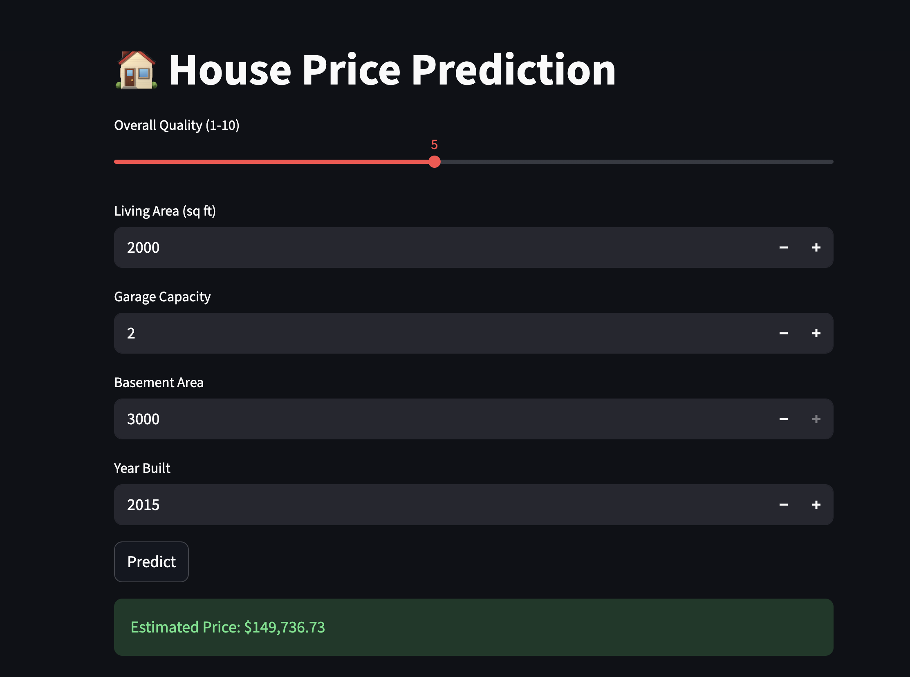

# 🏠 House Price Prediction System


---

## 🚀 Live Demo

https://house-price-prediction-nmigus4tx852ovyhhqz36u.streamlit.app/

### 📌 How it works:
- User enters house details (area, quality, garage, etc.)
- Machine Learning model processes inputs
- System predicts **estimated house price instantly**

---

### 🔹 Web App Interface


---

## 🧠 Overview

This is an **end-to-end Machine Learning regression system** that predicts house prices based on real housing features.

It demonstrates a complete ML lifecycle:
- Data preprocessing
- Feature engineering
- Model training
- Evaluation
- Deployment via web app

---

## 🎯 Problem Statement

Real estate pricing depends on multiple hidden factors.  
This system learns patterns from historical housing data to predict accurate property prices.

---

## 📂 Dataset

- Source: Kaggle – House Prices Advanced Regression Dataset  
- Records: 1460 houses  
- Features: 80+ including:
  - Area (GrLivArea)
  - Overall Quality
  - Garage Capacity
  - Basement Area
  - Year Built
  - Neighborhood & more

---

## ⚙️ Tech Stack

- Python 🐍  
- Pandas, NumPy  
- Scikit-learn 🤖  
- Streamlit 🌐  
- Joblib  

---

## 🔄 Workflow

### 1. Data Preprocessing
- Handled missing values (median/mode)
- Removed irrelevant features (Id, etc.)
- One-hot encoding for categorical variables

### 2. Feature Engineering
- Converted categorical → numerical features
- Aligned training and inference columns

### 3. Model Building
- Random Forest Regressor (final model)
- Train-test split (80/20)

### 4. Evaluation
- R² Score: ~0.89
- Strong generalization on unseen data

---

## 📈 Key Insights

- Overall Quality is the strongest price indicator  
- Living Area (GrLivArea) heavily influences price  
- Garage and Basement size significantly impact valuation  
- Feature engineering drastically improved performance  

---

## 🧪 How to Run Locally

```bash
git clone <your-repo-link>
cd house-price-prediction

pip install -r requirements.txt

python src/train.py

streamlit run app.py

house-price-prediction/
│
├── app.py
├── src/
│   ├── data_preprocessing.py
│   ├── train.py
│   └── predict.py
│
├── model/
│   ├── house_price_model.pkl
│   └── model_columns.pkl
│
├── data/
│   └── train.csv
│
├── images/
│   └── webpage.png
│
├── requirements.txt
└── README.md
```

## 🎯 Future Improvements
- Hyperparameter tuning (GridSearchCV)  
- Try XGBoost / LightGBM  
- Improve UI with more input features  
- Deploy on Streamlit Cloud / Render  

---

## 👤 Author

**Atharva Tiwari**


